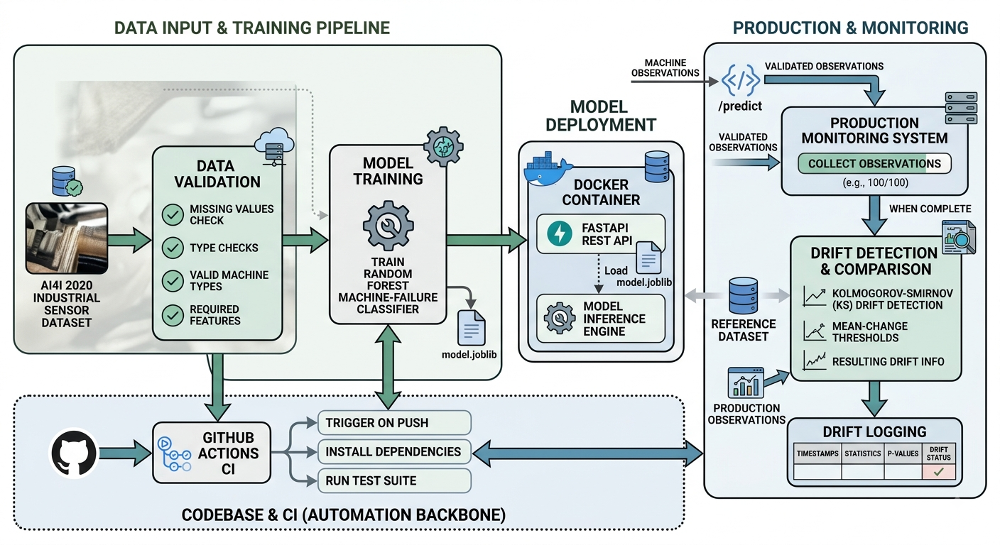
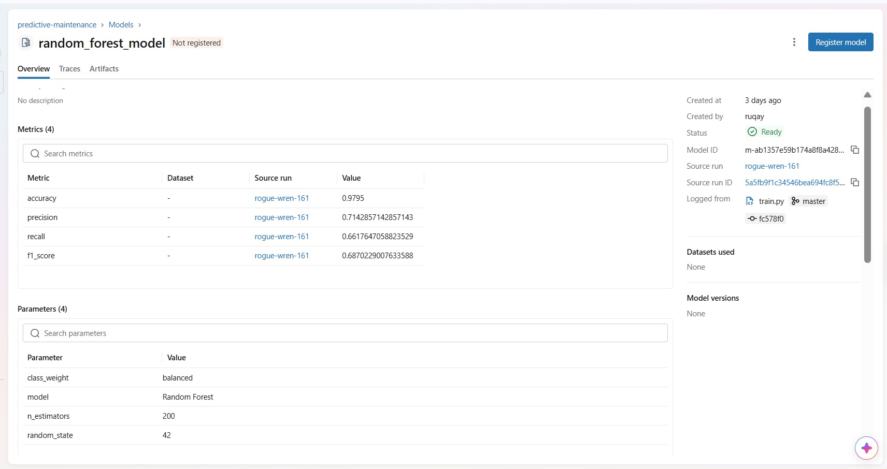
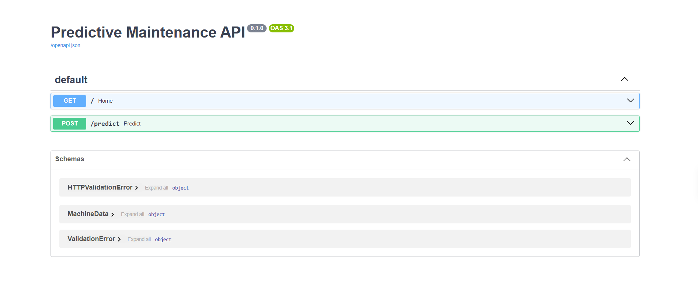
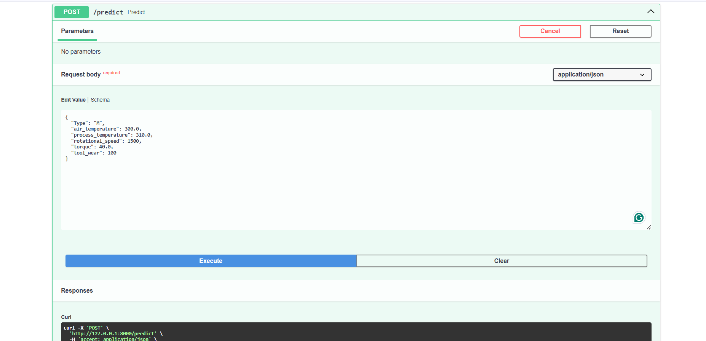
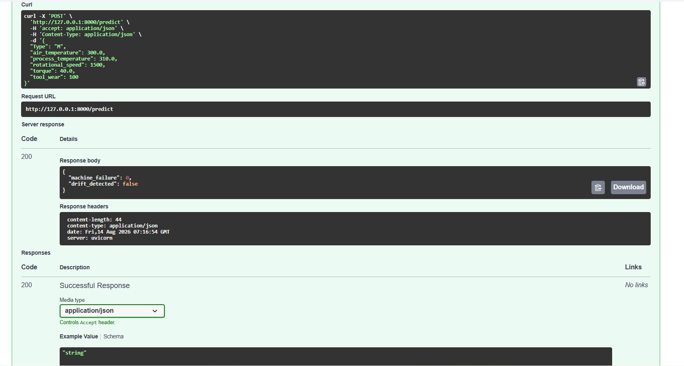
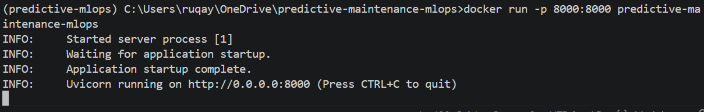

# Predictive Maintenance MLOps

An end-to-end machine learning system for predicting industrial machine failures and monitoring production data for data drift.

This project demonstrates the complete lifecycle of a machine learning application, from data validation and model training to experiment tracking, API deployment, containerization, automated testing, and production monitoring.

## Architecture



## Project Overview

Predictive maintenance is an important application of machine learning in industrial environments, where unexpected equipment failures can lead to downtime, maintenance costs, and production losses.

This project uses industrial sensor data to predict whether a machine is likely to experience a failure. Rather than focusing only on model training, the project implements an end-to-end MLOps workflow.

The system includes:

- Data validation
- Machine failure prediction
- Model training and evaluation
- MLflow experiment tracking
- MLflow Model Registry
- FastAPI model serving
- Docker containerization
- Automated testing with pytest
- GitHub Actions CI
- Production data monitoring
- Statistical data drift detection
- Drift result logging

## Key Features

| Feature | Description |
|---|---|
| Machine Failure Prediction | Predicts whether an industrial machine is likely to fail |
| Data Validation | Validates incoming production data before inference |
| MLflow | Tracks experiments, parameters, and evaluation metrics |
| Model Registry | Maintains trained model versions |
| FastAPI | Provides a REST API for real-time predictions |
| Docker | Packages the application into a reproducible container |
| Monitoring | Collects production observations |
| Drift Detection | Detects changes between reference and production data |
| Automated Testing | Tests API, validation, monitoring, and drift functionality |
| GitHub Actions | Automatically runs the test suite on code changes |

## Dataset

The project uses the **AI4I 2020 Predictive Maintenance Dataset**, which contains industrial machine measurements and machine failure labels.

The model uses:

- Type
- Air temperature [K]
- Process temperature [K]
- Rotational speed [rpm]
- Torque [Nm]
- Tool wear [min]

The target variable is:

- `0` — No machine failure
- `1` — Machine failure

## Machine Learning Model

A **Random Forest classifier** is used to predict machine failure.

The training pipeline preprocesses categorical and numerical features before training. The complete trained pipeline is saved using `joblib` and loaded by the FastAPI application for inference.

### Model Performance

| Metric | Score |
|---|---:|
| Accuracy | 97.95% |
| Precision | 71.43% |
| Recall | 66.18% |
| F1-score | 68.70% |

The failure-class recall is particularly important because missing an actual machine failure can be more costly than generating a false alarm.

## Experiment Tracking

MLflow is used to track training experiments, parameters, and evaluation metrics.



## FastAPI

The trained model is served through a **FastAPI REST API**.

The API:

1. Receives machine sensor measurements
2. Validates the input
3. Runs the trained model
4. Returns the predicted machine failure status
5. Reports the current drift status

### API Documentation



### Prediction Endpoint

The `/predict` endpoint accepts machine sensor measurements and returns the model prediction.





## Docker

The application is containerized with Docker to provide a reproducible environment for running the FastAPI inference service.



Build the Docker image:

```bash
docker build -t predictive-maintenance-mlops .
```

Run the container:

```bash
docker run -p 8000:8000 predictive-maintenance-mlops
```

The API documentation is available at:
http://127.0.0.1:8000/docs


Production Monitoring

The system monitors incoming production data and compares it against the reference data distribution.

The monitoring pipeline is:

Production Data
      ↓
Data Validation
      ↓
FastAPI Prediction
      ↓
Production Monitoring
      ↓
Monitoring Window
      ↓
Drift Detection
      ↓
Monitoring Logs
Data Drift Detection

Drift detection is performed using the Kolmogorov–Smirnov (KS) test.

The system compares reference data with newly collected production data and evaluates whether individual feature distributions have changed significantly.

Detected drift results are recorded by the monitoring logger.

Testing

The project includes automated tests covering:

FastAPI prediction endpoints
Input data validation
Drift detection
Monitoring logic
Monitoring integration
Monitoring logging
Production monitoring

The current test suite contains 14 tests, all passing successfully.

14 passed

Run the tests with:

python -m pytest
Continuous Integration

GitHub Actions automatically runs the test suite when changes are pushed to the main branch or when a pull request is opened.

The CI workflow is:

Git Push / Pull Request
        ↓
GitHub Actions
        ↓
Set up Python
        ↓
Install Dependencies
        ↓
Run Pytest
        ↓
Pass / Fail
Project Structure
predictive-maintenance-mlops/

│
├── .github/
│   └── workflows/
│       └── ci.yml
│
├── data/
├── docs/
│   ├── Gemini_Generated_Image_jfcqlbjfcqlbjfcq.png
│   ├── image.png
│   ├── overv.png
│   ├── api.png.png
│   ├── api2.png.png
│   └── docker.png
│
├── model/
│   └── model.joblib
│
├── src/
│   ├── create_production_data.py
│   ├── data_validation.py
│   ├── drift_detection.py
│   ├── monitoring.py
│   ├── monitoring_logger.py
│   ├── predict.py
│   └── train.py
│
├── tests/
│   ├── test_api.py
│   ├── test_data_validation.py
│   ├── test_monitoring.py
│   ├── test_monitoring_integration.py
│   ├── test_monitoring_logger.py
│   ├── test_monitoring_logging_integration.py
│   └── test_production_monitoring.py
│
├── Dockerfile
├── requirements.txt
└── README.md
Quick Start

Clone the repository:

git clone https://github.com/RugayyaSadigzade25/predictive-maintenance-mlops.git
cd predictive-maintenance-mlops

Install dependencies:

pip install -r requirements.txt

Run tests:

python -m pytest

Start the API:

uvicorn src.predict:app --reload

Open:

http://127.0.0.1:8000/docs
Technologies
Python
pandas
NumPy
scikit-learn
MLflow
FastAPI
Pydantic
Docker
pytest
GitHub Actions
Future Improvements
Automated model retraining after significant data drift
Model performance monitoring in production
Hyperparameter optimization
Scheduled retraining pipelines
Prometheus/Grafana observability
Cloud deployment
Automated Docker image publishing through CI/CD